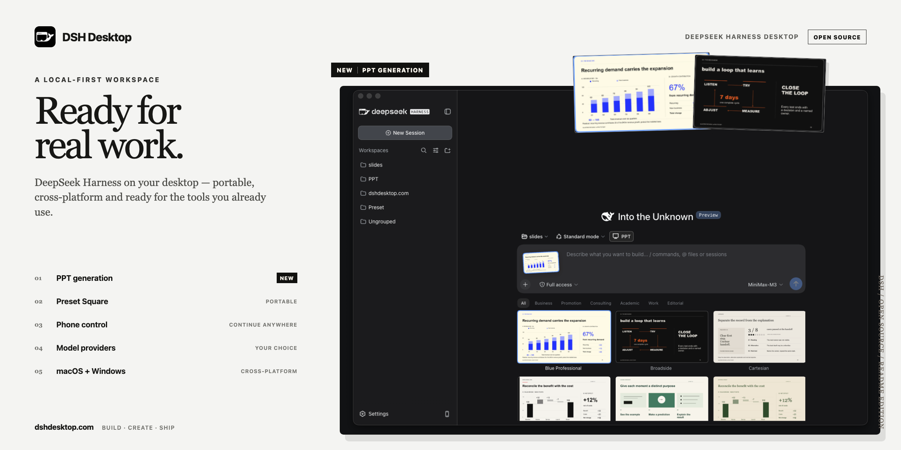

<h1 align="center">
  
  DSH Desktop
</h1>

<p align="center">
  Una aplicación de escritorio local y multiplataforma para
  <a href="https://github.com/deepseek-ai/deepseek-harness">DeepSeek Harness</a>.
</p>

<p align="center">
  <a href="README.md">English</a> · <a href="README.zh.md">简体中文</a> · <a href="README.ja.md">日本語</a> · <a href="README.ru.md">Русский</a> · <a href="README.es.md">Español</a> · <a href="README.pt.md">Português</a>
</p>

<p align="center">
  <a href="LICENSE"></a>
  
  
</p>



<p align="center"><strong>Usa modelos oficiales de DeepSeek o proveedores externos populares, administra Agent Preset portátiles, continúa tus sesiones de Harness desde el teléfono y convierte material de origen en presentaciones PPTX editables.</strong></p>

DSH Desktop convierte la experiencia local de DeepSeek Harness en una aplicación de escritorio instalable. Inicia Harness automáticamente, guarda Profile, plugins, espacios de trabajo, ajustes de modelos y sesiones fuera del directorio de la aplicación y abre la interfaz completa cuando el Runtime local está listo.

> [!IMPORTANT]
> DSH Desktop es una versión preliminar basada en `@deepseek-ai/dsh@0.1.5-rc.2`, que evoluciona rápidamente. Las versiones de macOS están firmadas y notarizadas por Apple. Los instaladores para Windows x64 también están firmados; las advertencias de seguridad de Windows pueden disminuir gradualmente a medida que el editor acumula reputación de descargas e instalaciones.

## Descarga

Ofrecemos versiones estables y preliminares: la **versión estable**, recomendada para el uso diario, se descarga desde el [sitio web oficial](https://www.dshdesktop.com/#download). Para probar una **versión preliminar**, elige una versión marcada como **Pre-release** en [GitHub Releases](https://github.com/dataelement/dsh-desktop/releases).

Las versiones preliminares incluyen nuestras nuevas funciones y adoptan con rapidez las últimas versiones oficiales de DeepSeek Harness. Pueden ser incompatibles con los plugins de la comunidad y **no se recomiendan para usuarios generales**. Invitamos a quienes quieran probar las novedades antes que nadie a compartir sus comentarios en la comunidad; solo distribuimos las actualizaciones a toda la comunidad después de que estos usuarios las hayan validado.

Las versiones instaladas comprueban actualizaciones poco después del inicio y cada seis horas. Cuando hay una versión nueva, DSH Desktop pregunta antes de descargarla; la instalación solo comienza al elegir **Restart and install**. También puedes comprobar manualmente o saltar una versión sin ocultar versiones posteriores.

## Comunidad

<p align="center">
  Escanea el siguiente código QR con WeChat para unirte al grupo de DSH Desktop.<br />
  <br />
  También puedes unirte a la <a href="https://discord.gg/he2gAKCpj">comunidad de DSH Desktop en Discord</a>.
</p>

## Qué añade DSH Desktop

DeepSeek Harness ya proporciona el Agent Runtime y la Web UI. DSH Desktop añade las capacidades nativas necesarias para un producto de escritorio:

- Inicia y detiene Harness sin una CLI separada ni otra pestaña del navegador
- Usa el selector de directorios del sistema para añadir y administrar espacios de trabajo
- Admite modelos oficiales de DeepSeek y proveedores externos populares
- Importa y exporta Agent Preset completos como [paquetes `.dshpreset`](docs/preset-packages.md) portátiles
- Convierte material de origen en presentaciones PPTX editables mediante el modo PPT integrado
- Conserva Profile, plugins, espacios de trabajo, sesiones y ajustes de modelos al actualizar la aplicación
- Detecta fallos de inicio y de plugins de la interfaz, guarda diagnósticos y ofrece recuperación guiada
- Incluye un Modo seguro no destructivo que bloquea temporalmente plugins de terceros
- Permite que un teléfono vinculado continúe sesiones por LAN o mediante un túnel público temporal opcional
- Comprueba actualizaciones de la aplicación y deja la descarga e instalación bajo control del usuario
- Adapta menús, barra de título, foco de ventana, tema y marca para macOS y Windows

## Creación de PPT

Activa el botón **PPT**, elige una plantilla y describe la presentación que necesitas. El catálogo incluye **16 plantillas y 192 diseños**, con salida PPTX editable. Las vistas previas están en inglés; las presentaciones pueden generarse en inglés o chino, con ajustes de fuentes para ambos idiomas. El idioma de la vista previa no determina el del resultado.

PPT viene preinstalado y sus instrucciones automáticas solo se aplican a las sesiones con el botón PPT activado. Consulta la [guía de PPT](packages/ppt-runtime/README.md) para conocer las plantillas, las validaciones y las fuentes de referencia.

## Acceso desde el teléfono

Elige **Connect Phone…** en el menú `Harness` y escanea el código. El escritorio debe aprobar explícitamente la conexión antes de que el teléfono acceda a las sesiones.

Harness permanece en un puerto aleatorio de `127.0.0.1`. El teléfono usa un Bridge independiente y vinculado: puede limitarse a la red local o activar un Cloudflare Quick Tunnel temporal para el acceso remoto.

Si Cloudflare no se inicia, la aplicación intenta usar Pinggy. Si aparece el enlace de Cloudflare pero el teléfono no puede abrirlo, selecciona **Can’t open? Try another link** para cambiar a Pinggy.

## Modo seguro y recuperación

Si un plugin de terceros impide el inicio o la visualización, DSH Desktop relaciona la evidencia del Runtime y del frontend con los plugins instalados y abre una recuperación guiada.

Elige **Restart as Safe Mode…** en el menú `Harness` para iniciar un Profile aislado con los Bundle oficiales principales. Los plugins externos del Profile normal quedan bloqueados, pero el Agent, las sesiones, los ajustes de modelos y los espacios de trabajo siguen disponibles.

La pantalla de recuperación busca actualizaciones compatibles de los plugins y permite instalarlas cuando están disponibles. El Modo seguro también permite actualizar varios plugins a la vez. Para pedir ayuda, pasa el cursor sobre **WeChat group** para mostrar el código QR, o haz clic en **Discord** para abrir la comunidad.

Si no puedes abrir la interfaz normal, inicia la aplicación con `--safe-mode`. En macOS:

```sh
open -a "DSH Desktop" --args --safe-mode
```

## Datos locales y seguridad

- La Web UI de Harness solo se sirve en un puerto loopback aleatorio.
- El Renderer no tiene privilegios de Node.js y utiliza Context Isolation y sandbox.
- Se bloquean WebView, navegación interna no confiable y solicitudes inesperadas de permisos.
- Profile y sesiones se guardan en los datos de usuario de la aplicación, no en el directorio de instalación.
- El teléfono necesita un Token de corta duración y aprobación explícita del escritorio.

## Plataformas compatibles

| Plataforma | Distribución | Estado |
| --- | --- | --- |
| macOS Apple Silicon | DMG/ZIP firmados y notarizados | Compatible |
| macOS Intel | DMG/ZIP firmados y notarizados | Compatible |
| Windows x64 | Instalador NSIS firmado | Compatible |
| Windows ARM64 | — | No compatible actualmente |
| Linux | — | No compatible actualmente |

Harness incluye dependencias nativas, por lo que cada artefacto se compila en el sistema operativo y la arquitectura correspondientes.

## Desarrollo y arquitectura

- [Guía de desarrollo](docs/development.md) — configuración, validación, mantenimiento de parches y empaquetado nativo
- [Arquitectura](docs/architecture.md) — Runtime, datos, seguridad, recuperación, teléfono y actualizaciones
- [Guía de publicación](docs/release-runbook.md) — firma y controles de publicación
- [Formato de paquetes Preset](docs/preset-packages.md) — contrato de Agent Preset portátil

Antes de enviar cambios, ejecuta `npm test`, `npm run typecheck` y `npm run build`, y prueba en la aplicación real el flujo afectado. Nunca incluyas claves API reales en Issue, registros, capturas o datos de prueba.

## Proyectos amigos

[dsh-market](https://github.com/dsh-market/dsh-market) es el mercado comunitario de plugins para DeepSeek Harness. Desde Harness puedes buscar y previsualizar plugins, instalar o actualizar paquetes, activarlos o desactivarlos y cambiar temas.

## Licencia

DSH Desktop se publica bajo la [licencia MIT](LICENSE).

DeepSeek Harness y sus dependencias siguen sujetos a sus licencias y políticas de marcas correspondientes. DSH Desktop es una aplicación de escritorio comunitaria independiente.
