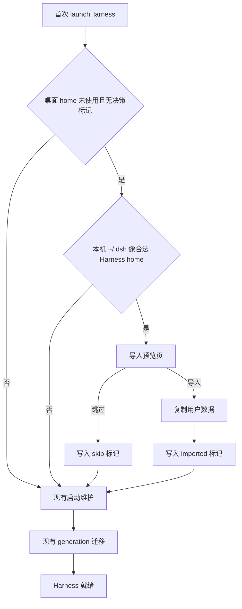
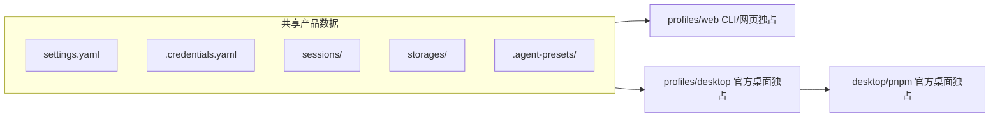

# 网页版到桌面端无痛迁移

> 文档基线：当前源码（2026-09-11，v0.9.0），并对照上游 [deepseek-ai/deepseek-harness](https://github.com/deepseek-ai/deepseek-harness) 的 `apps/desktop`（2026-09-08 查阅）。本文件记录同机 Web → Desktop 一次性导入的产品与实现方案；核心导入、导入页与单测已落地。
>
> 官方网页版指 [DeepSeek Harness](https://www.deepseek.com/harness/en/) 的本机 `npx @deepseek-ai/dsh web`，不是云端托管账户。

## 1. 结论摘要

网页版与桌面端共用同一套 Harness 文件模型，差异只在 home 路径：

| 运行方式 | 默认 `DSH_HOME` |
| --- | --- |
| 网页版 `npx @deepseek-ai/dsh web` | `~/.dsh` |
| DSH Desktop | `{Electron userData}/harness`（macOS 约为 `~/Library/Application Support/dsh-desktop/harness`） |

两边会话、设置、密钥、工作区 registry、Preset、Skill、插件清单格式兼容。桌面端打开后像「全新安装」，是因为从未读取 `~/.dsh`。

本方案：首次启动检测本机 `~/.dsh`，经用户确认后**复制**到桌面 home，再走现有 generation 迁移启动。不改写网页版数据，导入后两边独立。本阶段只覆盖同机；不做跨机器导出包，也不做导入后的双向同步。

## 2. 产品原则

- **复制，不共用**：不把桌面 `DSH_HOME` 指到 `~/.dsh`。官方桌面端选择共用 home、隔离 `profiles/desktop`（见第 8 节）；我们仍用 `profiles/web` + generation，共用会改写网页版 profile，也不适合长期双开。
- **只问一次**：仅当桌面端尚未产生用户数据时弹出。跳过或导入后都写决策标记，不再打扰。
- **不破坏网页版**：只读 `~/.dsh`，不移动、不删除。用户仍可继续用 `dsh web`，只是之后数据不再同步。
- **插件不整树拷贝**：不复制完整 `node_modules` / `pnpm-lock.yaml`。只带上清单和每个社区插件已安装的 `package.json`，交给现有 `src/main/state/generation-migration.ts` 从 registry 装成 generation。

## 3. 用户路径



1. 用户安装并打开 DSH Desktop。
2. `launchHarness()` 在 `runProfileStartupMaintenance` **之前**检测本机 `~/.dsh`。此时 Harness 已 stop，桌面 profile 尚未被 `initProfile` 写成空壳。
3. 若命中，主窗口从 splash 切到导入页（风格对齐现有 `build/splash.html` / `build/safe-mode.html`）：
   - 标题：发现网页版数据
   - 预览：会话数、工作区数、自定义 Preset 数、社区插件名、是否已有模型密钥
   - 说明：导入后桌面与网页版各自独立；网页版数据不会被改写
   - 主按钮「导入并继续」，次按钮「从空白开始」
4. 导入过程显示进度（复制会话可能较大）。完成后走现有 splash + generation 迁移 + 启动。
5. 跳过则写 skip 标记，直接空白启动。

Safe Mode 冷启动（`--safe-mode`）不弹导入。桌面 home 里已有 `settings.yaml`、非空 `sessions/`、或已有决策标记时不弹。

## 4. 数据范围

### 4.1 两边的数据模型

网页版与桌面端都把权威数据落在 `$DSH_HOME` 文件系统，而不是浏览器 IndexedDB 或云端账户：

```text
$DSH_HOME/
├── settings.yaml                 # 模型 / locale / Provider 等
├── .credentials.yaml             # API 密钥与凭据
├── sessions/                     # JSONL/Zstd 会话日志
├── storages/                     # workspace registry 等
├── .agent-presets/               # 用户自定义 Agent Preset
├── skills/                       # 用户级 Skill
└── profiles/web/
    ├── package.json              # 插件依赖与 bundles
    ├── cordis.patch.yml          # 用户 patch
    └── node_modules/             # 网页版共享树；桌面端另有 generation
```

工作区项目文件不在 `DSH_HOME` 里。会话 JSONL 用 `cwd` 关联本机路径；同机导入后路径仍然有效。

### 4.2 复制清单

源：`homedir()/.dsh`（与 `packages/dshmarket/src/home-paths.ts` 的 `defaultDshHome()` 一致）  
目标：`join(app.getPath('userData'), 'harness')`，必须仍为空。

| 复制 | 跳过 |
| --- | --- |
| `settings.yaml` | `profiles/web/node_modules` 整树 |
| `.credentials.yaml` | `pnpm-lock.yaml`、`.dsh-market` |
| `sessions/` | `profiles/.generations`（网页版通常没有） |
| `storages/`（含 workspace registry） | 浏览器 localStorage（UI 偏好，非权威） |
| `.agent-presets/` | `.anonymous-user-id`（遥测） |
| `skills/` | |
| `profiles/web/package.json`、`cordis.patch.yml`、`.npmrc` | |
| 每个社区插件的 `profiles/web/node_modules/<name>/package.json` | |

社区插件判定与 generation 迁移相同：`package.json` 的 `dependencies` ∪ `dsh.profile.bundles`，排除 `dshmarket`、`@deepseek-ai/dsh-base`、`@deepseek-ai/dsh-web-app`。本地 / `file:` / `git:` 规格额外复制该插件目录，供 `sourceDirectory` 使用。

### 4.3 明确不承诺

- 浏览器里的 localStorage（主题、最近 Preset 等）
- 导入后与网页版双向同步
- 跨机器导出包（后续可再加「选择目录导入」）
- 第三方社区插件若已从 registry 下架，可能装不上；会话和密钥仍可用，插件可在市场重装

## 5. 实现落点

### 5.1 导入逻辑

新增纯逻辑模块 `src/main/state/web-home-import.ts`：

- `defaultWebHome()` → `~/.dsh`
- `inspectWebHome(path)`：是否像 Harness home（存在 `settings.yaml` / `sessions` / `profiles/web/package.json` 任一）
- `previewWebHome(path)`：会话目录数、workspace 条目、preset 数、插件列表、是否有 credentials
- `desktopHomeIsUnused(dshHome)`：无决策标记且无用户数据
- `importWebHome({ source, dest, onProgress })`：按清单 `fs.cp`（dereference 符号链接、拒绝跳出 dest）
- 决策文件：`harness/.web-import-decision.json`（`decision: imported | skipped`、`source`、`at`）

导入失败时目标目录保持可回滚：先拷到 `harness.import-tmp`，成功后再 rename；失败则删临时目录并留在导入页可重试。

### 5.2 导入页

新增宿主页 `src/main/web-import-view.ts` 与 `build/web-import.html`。IPC 模式对齐 Safe Mode：预览同步加载、导入/跳过回传 Main。文案走现有 `harnessLocale()`。

### 5.3 启动插入点

在 `src/main/index.ts` 的 `launchHarness()` 里，`await runtime.stop()` 之后、`runProfileStartupMaintenance` 之前插入：

```ts
if (await shouldOfferWebHomeImport(dshHome)) {
  const choice = await showWebHomeImport(previewWebHome(defaultWebHome()))
  if (choice === 'import') await importWebHome(...)
  else await writeSkipDecision(dshHome)
}
```

成功后再进入现有维护：

- 无社区插件 → generation 迁移 `no-op`
- 有插件且带了 `package.json` → `installGeneration`
- 缺清单 → 已有 `deferred-failure`，不阻断会话/设置

不改 `DSH_HOME` 解析。不复用 dshmarket profile backup（那份不含会话）。不在本阶段做跨机器导出包或二次合并。

## 6. 测试

`test/web-home-import.test.ts`：

- 识别合法 / 空 / 不存在的 `~/.dsh`
- 桌面已有 settings 或决策标记时不提示
- 复制清单：会话、settings、credentials、storages、preset、skill、profile 清单在；`node_modules` 整树、lock、market 缓存不在
- 社区插件只带各包 `package.json`
- skip / imported 标记写入后不再 offer
- 导入失败不留下半成品 `harness/`

## 7. 后续可选

本阶段不做。若以后需要扩大范围，优先顺序：

1. 设置页提供「从网页版重新导入」或手动选择一个 `DSH_HOME` 目录（覆盖用户从另一台机器拷来的 `~/.dsh`）。
2. 正式便携包（网页版导出 / 桌面端导入），支持跨机器。
3. 浏览器 localStorage → `profiles/web/desktop-storage.json` 的可选合并。
4. 若产品日后改为官方模型（共用 `~/.dsh` + 独占 `profiles/desktop`），可去掉导入向导；那是另一条架构线，不在本阶段。

## 8. 官方桌面端对照

上游仓库 [deepseek-ai/deepseek-harness](https://github.com/deepseek-ai/deepseek-harness) 自带官方 Electron 桌面端：[`apps/desktop`](https://github.com/deepseek-ai/deepseek-harness/tree/master/apps/desktop) 与私有 Host [`apps/desktop-host`](https://github.com/deepseek-ai/deepseek-harness/tree/master/apps/desktop-host)。说明见 [`apps/desktop/README.zh.md`](https://github.com/deepseek-ai/deepseek-harness/blob/master/apps/desktop/README.zh.md)。

官方**没有**「从网页版导入」向导，也没有把 `~/.dsh` 拷到另一份 home。数据同步方式是：**共用同一个 `$DSH_HOME`，只隔离可执行 profile 和包管理器**。

### 8.1 官方代码里实际怎么「同步」

仓库里**没有**导入、拷贝、watch、云同步任何一类代码。`project-manager.ts` 里的 `copyMetadata` / `cpSync` 只在 `$DSH_HOME/profiles/desktop` 与 staging 之间搬 `package.json`、lockfile，给插件安装用，不碰会话。

产品数据能看见网页版，是因为 **Host 启动后走同一套 `dsh-base`，home 解析也落在同一个 `~/.dsh`**。

启动链：

1. [`apps/desktop/src/main.ts`](https://github.com/deepseek-ai/deepseek-harness/blob/master/apps/desktop/src/main.ts) 调用无参 `resolveDesktopPaths()`。
2. [`apps/desktop/src/paths.ts`](https://github.com/deepseek-ai/deepseek-harness/blob/master/apps/desktop/src/paths.ts) 用 `resolveDshHome()`（显式配置 → `$DSH_HOME` → `~/.dsh`），注释写明 *without changing the shared data roots*。Electron 只认这些自己的路径：
   - `$DSH_HOME/profiles/desktop` — 运行 profile
   - `$DSH_HOME/desktop/pnpm/store` — 私有 pnpm
   - `$DSH_HOME/desktop/staging|rollback` — 安装事务
3. [`host-process.ts`](https://github.com/deepseek-ai/deepseek-harness/blob/master/apps/desktop/src/host-process.ts) spawn 内置 Node 时**不改写 `DSH_HOME`**，只过滤 `DSH_DESKTOP_*` / `npm_*` / `pnpm_*` / `NODE_OPTIONS`，其余 `process.env` 原样继承。
4. [`apps/desktop-host/src/index.ts`](https://github.com/deepseek-ai/deepseek-harness/blob/master/apps/desktop-host/src/index.ts) 的 `runDesktopHost`：
   - `loadLayeredEnv('dsh desktop')` 再次 `resolveDshHome()`，并读 `$DSH_HOME/.env`
   - `boot('dsh desktop', …)` 加载 `profiles/desktop` 的 bundle（`dsh-base` + `dsh-web-app`）再叠 [`desktop.cordis.patch.yml`](https://github.com/deepseek-ai/deepseek-harness/blob/master/apps/desktop-host/config/desktop.cordis.patch.yml)
5. 桌面 overlay **只关** `webserver` / `web-startup` / `web-runtime` 等听端口的行，改走 `dsh-app://` 管道；**不改** session / settings / credentials / storage 的 root。这些仍是 `dsh-base` 默认值：
   - `session-persistence-jsonl.root` = `dshHomePath('sessions')` → `~/.dsh/sessions`
   - `storage-json.root` = `dshHomePath('storages')` → `~/.dsh/storages`
   - `settings-file` → `~/.dsh/settings.yaml`
   - `credentials-local` → `~/.dsh/.credentials.yaml`

所以**已安装的官方 Desktop** 和网页版 `npx @deepseek-ai/dsh web` 打开的是**同一批文件**。之后任一边写入，另一边下次读（settings 还热重载）就能看到。不是同步协议，是共享目录。

从官方仓库跑 `pnpm run dev:desktop` / `start:desktop` **不会**读 `~/.dsh`。[`apps/desktop/scripts/dev.ts`](https://github.com/deepseek-ai/deepseek-harness/blob/master/apps/desktop/scripts/dev.ts) 会强制：

```ts
const home = resolve(process.env.DSH_HOME ?? join(DEVELOPMENT_ROOT, 'home'))
// DEVELOPMENT_ROOT = apps/desktop/.desktop-build/development
environment.DSH_HOME = home
```

未设 `DSH_HOME` 时，开发态用空的隔离 home，侧边栏当然看不到网页版项目。控制台会打 `desktop development: DSH_HOME=...`。要在开发态验证共用，需显式：

```sh
DSH_HOME="$HOME/.dsh" pnpm run dev:desktop
```

官方 README 写明：开发态的 sessions / settings / credentials 刻意不进用户正常 Harness home，避免污染 `~/.dsh`。

```ts
export function resolveDesktopPaths(dshHome: string = resolveDshHome()): DesktopPaths {
  const root = join(dshHome, 'desktop')
  return {
    root,
    profile: join(dshHome, 'profiles', 'desktop'),
    // staging / rollback / pnpm store 都在 $DSH_HOME/desktop/
  }
}
```



### 8.2 和本方案的差异

| 点 | 官方 `apps/desktop` | 本仓库 DSH Desktop（本方案） |
| --- | --- | --- |
| 默认 `DSH_HOME` | `~/.dsh` | `{userData}/harness` |
| 与网页版数据关系 | 实时共用，无需导入 | 首次启动复制一次，之后独立 |
| 运行 profile | `profiles/desktop`，CLI 不能改 | `profiles/web` + generation |
| 插件 / `node_modules` | 桌面独占，不碰网页版 profile | 导入清单后按 generation 重装到桌面 home |
| 双开风险 | 产品数据共享；官方用单实例锁防两个桌面后端。并发 CLI + Desktop 仍可能争用 `storages/workspace.json`（上游 [Discussion #1485](https://github.com/deepseek-ai/deepseek-harness/discussions/1485)） | 复制后目录隔离，无此争用 |
| 无痛程度 | 打开即同步，之后也继续同步 | 一次导入后两边分叉 |

官方能安全共用 home，是因为桌面**不写** `profiles/web`。我们当前 generation 迁移、市场安装、Safe Mode 都绑在 `profiles/web` 上；若直接把 `DSH_HOME` 指到 `~/.dsh`，会改写网页版的包图和 lockfile。这是本方案坚持复制、不共用的原因。

### 8.3 本阶段从官方借鉴、但不照搬的点

- **只拷产品数据，不拷可执行树**：与官方「共享 sessions/settings/credentials/workspaces，不共享 node_modules / lockfile」一致。
- **源路径用同一套 `resolveDshHome()` / `defaultDshHome()`**：官方和网页版都认 `~/.dsh`。
- **不把桌面 `DSH_HOME` 改成 `~/.dsh`**：保持现有 `{userData}/harness` 与 generation 模型。
- **不做持续双向同步**：官方靠共用目录自然同步；我们复制后即分叉。

若日后要完全对齐官方，需要先引入独占的 `profiles/desktop`（或等价保留 profile），再改 `DSH_HOME` 解析；那会动启动、市场、Safe Mode 和 generation，超出本阶段导入范围。
